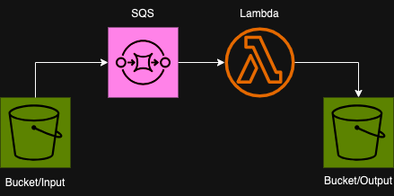

# S3_SQS_Lambda_Project
This project will create a S3 bucket with two sub folders, where we will receive external data, as soon as the bucket receives data, it will send a message to SQS, then it will call a lambda function to add an aditional column, it will transform it and send it to another subfloder converted.

